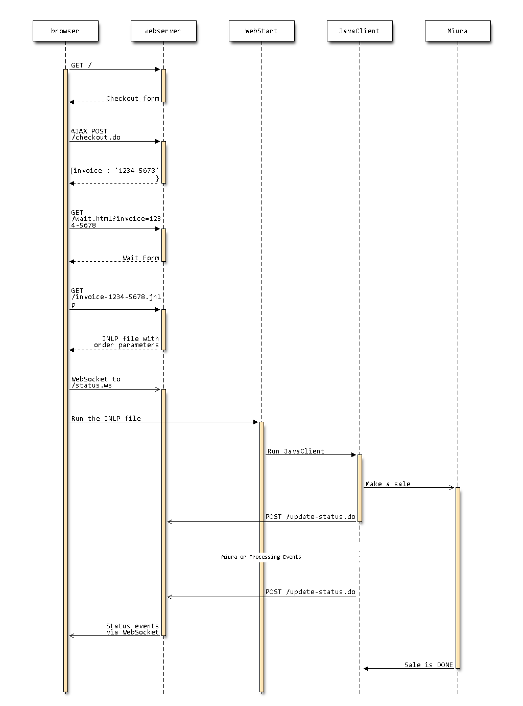

How to use the mPOS SDK via Java Web Start
==========================================

The Overall Process



How to run this example
-----------------------

* Make a project

```bash
   mvn clean install
```

* Create your certificate, private key and put them to a key stores (JKS and P12).
  
```bash
   cd client && create-keystore.sh
```

* Install your certificate in Java

 1. open Java control panel
 2. select "Security" tab
 3. click "manage Certificates..." button
 4. select "Signer CA" option in the "Certificate type" combo-box
 5. import your CA's certificate
   
* Copy new mpos.jar to a web-server

```bash
 cd client && ./assemble.sh
```

* Assemble a webserver single jar archive

```bash
   cd server && ./assemble.sh
```

* Fix UNTRUSTED a Java WebStart application

There are many empty web folders in mpos.jar.
They haven't got signatures. For example:

```
           0 Mon Aug 25 14:48:18 MSK 2014 com/google/thirdparty/publicsuffix/
           0 Mon Aug 25 14:48:18 MSK 2014 com/google/thirdparty/           
```

So Java Web Start fails to validate it.
To fix it simple disable cache in Java Control Panel at "General" tab in "Temporary Internet Files"

* Run a webserver

```bash
   java -jar server/target/server-1.0-1-SNAPSHOT-jar-with-dependencies.jar
```
   
* Open your browser at http://localhost:8080
